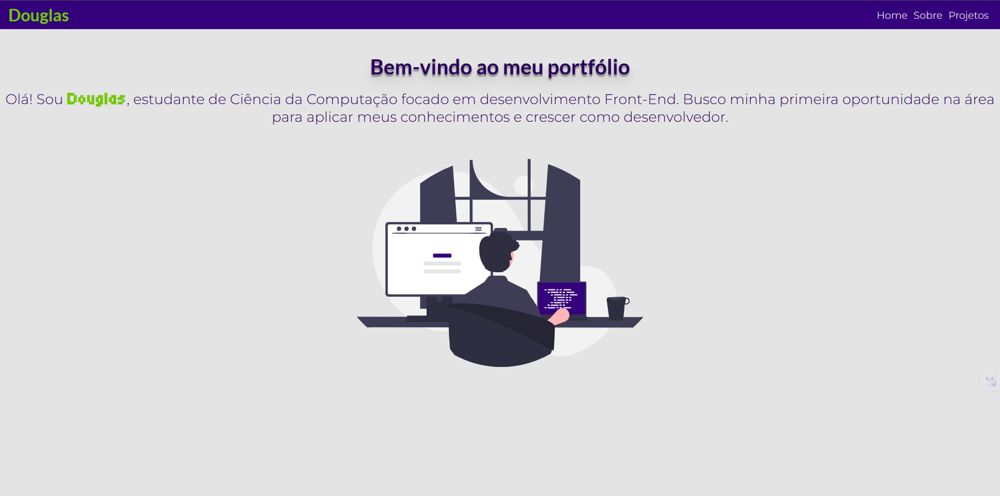

# portfolio 

Web application developed with React + TypeScript + Sass, created to showcase my projects, my career in front-end development, and contact details.
The website includes pages such as Home, About, and Projects, featuring a responsive design tailored for recruiters and companies.

  
*Homepage portfolio.*

---

## 🧩 Technologies Used

- **HTML5** – Semantic structure of the application  
- **CSS3** – Styling and responsiveness  
- **Lucide React** - Library for displaying icons and symbols
- **motion** - Library for animation and Transitions
- **react-router-dom** - Library for Page routing
- **TypeScript** - Adds static typing for safer and more maintainable code
- **React** – Library for building the user interface  
  - **Array methods** – Data manipulation (e.g.,`map`)  
  - **react-select** – Customizable select input component

---

## 🚀 Features

 1. Home page with introduction and main highlight. 
 2. About page with personal summary and Front-End career history.
 3. Projects page listing works, with links to repository and deploy.
 4. Navigation with **React Router**.
 5. Animation and Transition with **motion**

---

## 📥 Installation and Running

1. Clone this repository:
   ```bash
   git clone https://github.com/your-username/portfolio.git

